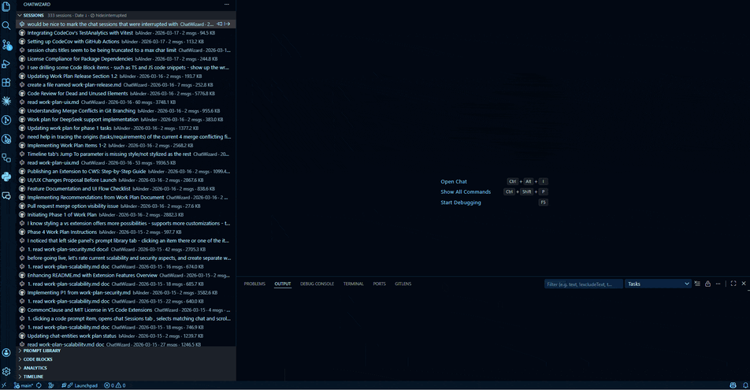
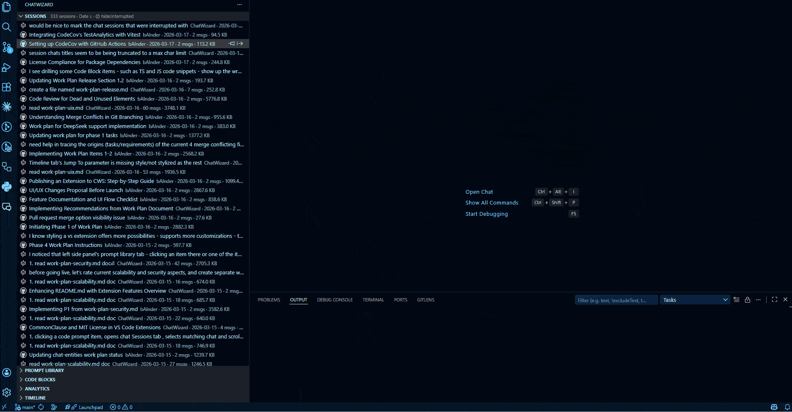
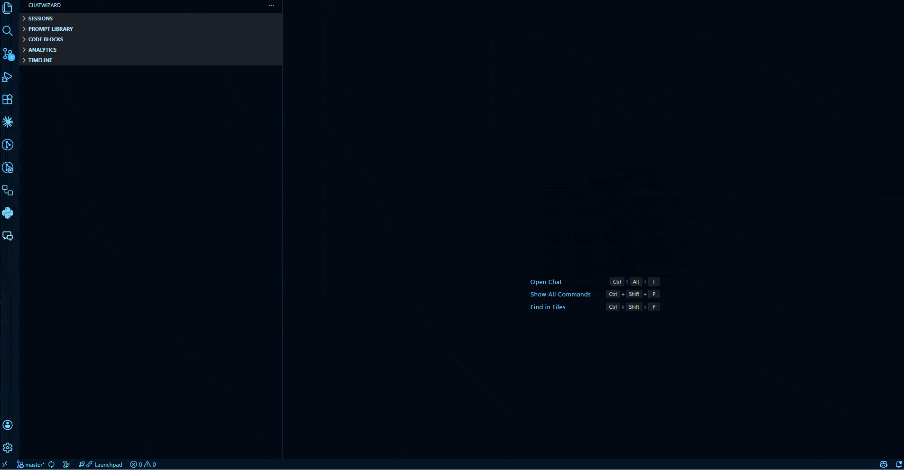
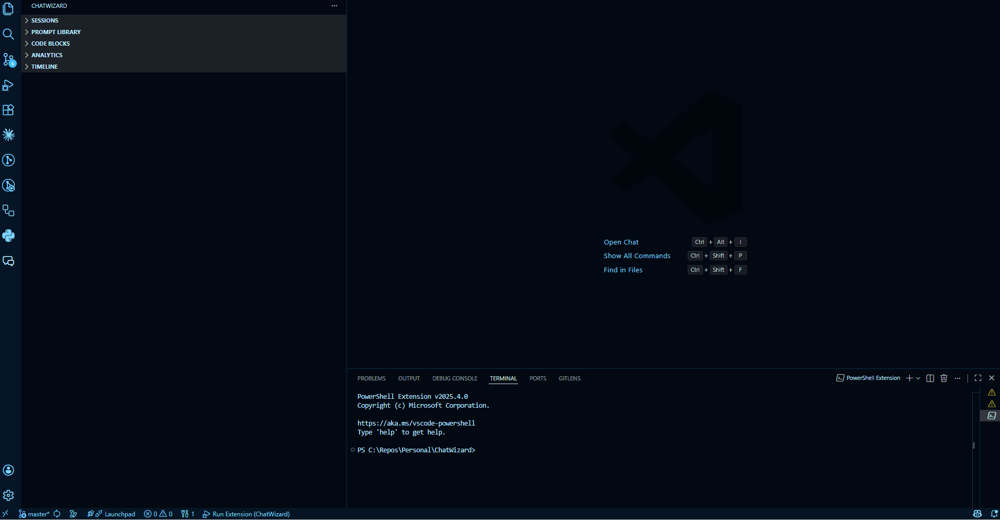
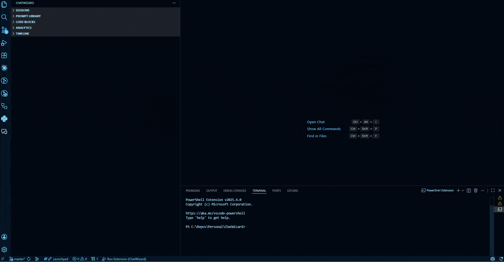
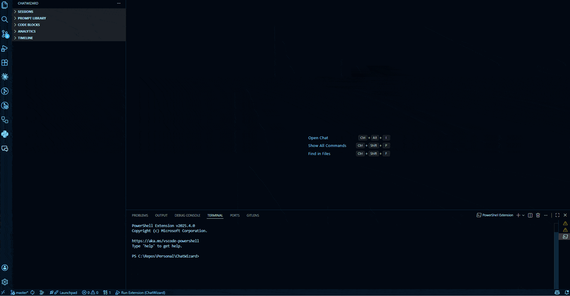
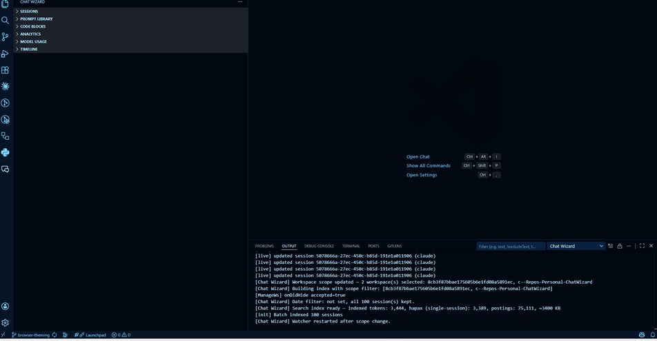

# ChatWizard

Inspired by https://github.com/Veverke/bAInder, I decided to make a VS Code extension, with a developer perspective in mind.

Your AI chat history — unified, searchable, and always yours. Chat Wizard reads session data from every major AI coding tool and gives you a single place to search, browse, and analyse it all. Your conversation history is no longer trapped inside whichever tool or IDE created it.

> **Tags:** AI chat manager · Copilot chat manager · Claude chat manager · chat history viewer · prompt library · code block search · token usage analytics · LLM productivity · VS Code AI tools · conversation history manager · Cline chat manager · Roo code chat manager · Cursor chat manager · Windsurf chat manager · Aider chat manager

---

## Why ChatWizard?

- **Your history travels with you.** Switch from Cursor to VS Code, try Windsurf for a project, add Cline to your workflow — your full conversation archive stays intact and searchable in one place. No more context lost when you change tools or IDEs.
- **Everything in one view.** Whether you use one AI coding tool or five, Chat Wizard aggregates sessions from all of them. Search across a year of Copilot, Claude, Cline, Cursor, Windsurf, and Aider conversations in a single query.
- **100% local, read-only, zero setup.** Chat Wizard never makes a network call, never modifies your session files, and requires no API key or account. It passively reads what your existing tools already write to disk.
- **Not just a viewer.** Full-text search with regex, a deduplicated prompt library, a code block archive, per-model usage analytics, and a timeline with activity heat maps — capabilities that no individual AI tool exposes.

---

## Demos

### Search — Search Bar & Search Command

### Export to Markdown — Full Session & Excerpt

### Session Filters

### Prompt Library

### Code Blocks (snippets)

### Analytics

### Model Usage

---

## Features

### Session Management Panel
A sortable, filterable, pinnable, and drag-and-drop reorderable TreeView listing every AI chat session across all your workspaces — from GitHub Copilot Chat, Claude Code, Cline, Roo Code, Cursor, Windsurf, and Aider. Each row shows workspace, date, message count, and file size. Hover over any session for a rich tooltip showing title, source, model, workspace, date, size, prompt/response split, and pin status. Click any session to open a full Markdown-rendered conversation reader.

**Sorting** — Toolbar buttons cycle through five sort keys: Date, Workspace, Length (message count), Title (alphabetical), and Model — each with an ascending/descending direction toggle. Open **Configure Sort Order…** to build a multi-key composite sort with up to 3 criteria, each with its own direction. Sort preferences persist across VS Code restarts.

**Filtering** — The filter toolbar button lets you set any combination of: title substring, date range (from / until, YYYY-MM-DD), AI model substring, and minimum or maximum message count. An active filter is shown in the view header and cleared in one step.

**Organisation** — Pin important sessions to keep them at the top of the list (pins persist across restarts). Drag and drop sessions into a custom manual order (also persisted). Select multiple sessions (`Ctrl+Click`) for bulk export. Inline icon buttons on each row give quick access to pin and export without right-clicking.

**Grouping** — A toolbar toggle button groups sessions into date buckets (Today, Yesterday, This Week, This Month, Older) — on by default. Click the same button to switch to a flat list. The chosen mode persists across VS Code restarts.

**Pagination** — A "Load More (N remaining)" entry appears at the bottom when sessions exceed the page size.

### Session Reader
Opening any session launches a VS Code webview panel rendering the full conversation in Markdown — user messages with a configurable accent-color border, assistant messages styled to the VS Code theme, and syntax-highlighted fenced code blocks throughout. Re-opening a session reuses the existing tab rather than spawning a duplicate.

For very large sessions (500+ messages) only the most-recent messages are shown initially, with a banner to load earlier content on demand. Rendering is streamed in small batches so the panel is interactive immediately. When opened from the Code Blocks panel, the reader can auto-scroll to and highlight the specific block that was clicked.

### Unified Full-Text Search
Open **ChatWizard: Search** from the Command Palette to launch an instant QuickPick panel covering all messages in all sessions across all workspaces. Results appear as you type, powered by an in-memory inverted index with no external dependencies.

- **Regex mode** — prefix the query with `/` to switch to regular-expression matching.
- **Source filter** — toggle between All sources or any individual source (Copilot, Claude, Cline, Roo Code, Cursor, Windsurf, Aider) with an in-panel toolbar button.
- **Role filter** — toggle between All messages / Prompts only / Responses only.
- Each result shows a source icon, session title, workspace, date, and a role-labelled snippet (`You: …` or `Copilot: …`) with matched text highlighted.
- When results exceed 500, a banner prompts you to refine the query.
- Selecting a result opens the session reader scrolled to the matched message.

### Export to Markdown
Export any session or set of sessions to structured `.md` files. Exports use H2 headings for user prompts, H3 headings for AI responses, fenced code blocks with language identifiers, and a metadata header (source, model, date, workspace).

| Trigger | How |
|---------|-----|
| Single session | Right-click a session → **Export Session to Markdown** |
| All sessions | Sessions toolbar → **Export All Sessions…** |
| Multiple sessions | Sessions toolbar → **Export Selected Sessions…** (QuickPick multi-select) |
| Excerpt | Command Palette → **ChatWizard: Export Session Excerpt…** |

When exporting more than one session you choose between **one file per session** (written to a folder you pick) or a **single combined file** with a navigable table of contents.

### Code Block Library (Code Blocks Panel)
Browse every fenced code block the AI has ever generated across all sessions and workspaces. Each entry shows language, originating session title, date, source, workspace, and message role. Click any entry to open the parent session and jump directly to that code block, with an optional colored highlight.

**Filter** — Narrow the view by language substring, content substring, source (Copilot / Claude), or message role (user / assistant).

**Sort** — Five sort keys (Date, Workspace, Length, Session Title, Language) each with ascending/descending direction, toggled via toolbar icon buttons.

**Grouping** — A toolbar toggle button groups code blocks by language — on by default. Each language bucket shows the block count. Click the same button to switch to a flat list. The chosen mode persists across VS Code restarts.

**Copy** — One-click clipboard copy for any code block.

Available as both the sidebar tree and as a standalone editor panel (`ChatWizard: Show Code Blocks`). A "Load More" entry appears as the block count grows.

### Prompt Library (Prompt Library Panel)
A deduplicated, frequency-ranked library of every user-turn prompt you have ever typed. Exact duplicates are collapsed into a single entry showing how many times and across how many projects you have used it. Search the library by keyword and copy any prompt to the clipboard for reuse. Available as both the sidebar tab and as a standalone editor panel (`ChatWizard: Show Prompt Library`).

### Near-Duplicate Prompt Detection
Integrated into the Prompt Library, a trigram-similarity clustering algorithm groups semantically near-duplicate prompts that are not exact matches. Each cluster shows its total equivalent usage count and lists all variants with originating session and date. A **Merge** action collapses the cluster into a single canonical entry. Clustering runs asynchronously and is cached — it only reruns when the prompt index changes.

### Analytics Dashboard (Analytics Panel)
A Chart.js-powered webview with live aggregate statistics across all sessions:

- **Summary cards** — total sessions, total messages, total estimated tokens.
- **Daily activity chart** — line chart of message volume over time.
- **Top projects table** — projects ranked by estimated token consumption.
- **Top terms bar chart** — the 20 most frequent words in your user prompts.
- **Longest sessions tables** — top 10 by message count and top 10 by token count.

Token counts are local approximations (Claude: characters ÷ 4; Copilot/GPT: words × 1.3). No external tokeniser or network call is required. The dashboard refreshes automatically as new sessions are indexed. Open via `ChatWizard: Show Analytics Dashboard` or the **Analytics** sidebar tab.

### Workspace Management
Control exactly which workspaces ChatWizard indexes and watches. Open **Chat Wizard: Manage Watched Workspaces** from the Command Palette to get a multi-select QuickPick listing every discovered Copilot and Claude workspace on your machine.

Each row shows the workspace folder name, full path, combined data size (KB / MB), and session count. The currently open VS Code workspace is pre-selected and cannot be fully deselected. Confirming a changed selection persists the new scope and restarts the file watcher so only the chosen workspaces are indexed. The session count shown uses live index data when available, falls back to a persistent cache for workspaces that were previously indexed, and uses an approximate disk count for workspaces that have never been loaded.

### Model Usage Panel
A date-range–scoped dashboard showing how many user requests were sent to each AI model. Open via the **Model Usage** sidebar tab.

- **Date range picker** — set a from/to date range; the panel defaults to the current calendar month.
- **Model breakdown** — models are ranked by request count and shown with a percentage share of total requests.
- **Workspace and session drill-down** — expand any model row to see which workspaces and individual sessions drove the most requests.
- **Friendly model names** — raw API model identifiers are normalised to readable names (e.g. `claude-sonnet-4-6` → `Claude Sonnet 4.6`).
- Auto-refreshes as new sessions are indexed.

### Timeline View (Timeline Panel)
A chronological month-grouped feed of all sessions across all workspaces. Each card shows project name, session title, first prompt, message count, and date.

- **Jump to date** — type a `YYYY-MM` value to scroll instantly to any month in history.
- **Filters** — source dropdown narrows the feed without a full reload.
- **Pagination** — loads 3 months at a time; a **Load More** button fetches the next batch.
- **Search** — filter the feed to entries whose title or first prompt match a keyword.
- **Activity heat map** — a calendar grid colour-coded by session density; click any day to filter the feed to that date.
- **Work bursts** — sessions within a 2-hour window are clustered into focused work-burst cards, showing duration, source mix, and total messages.
- **Topic drift ribbon** — displays the top 3 keywords from your prompts for each ISO week, letting you see how your focus shifts over time.
- **Stats bar** — at-a-glance counters: active days this week, total sessions, current daily streak, longest streak, and "on this day last month" sessions.
- Clicking any card opens the session reader.

### Live File Watching
A `FileSystemWatcher` monitors all configured source directories — Copilot Chat workspace storage, Claude Code projects, Cline/Roo Code task directories, Cursor and Windsurf `state.vscdb` files, and Aider `.aider.chat.history.md` files in open workspace folders. When a session file is created or updated, only that entry is re-parsed and re-indexed — no full rebuild. All views (Sessions, Code Blocks, Prompt Library, Analytics, Timeline) refresh automatically without user action.

### Configurable Data Source Paths
Override the default discovery paths for any supported source (Claude Code, Copilot Chat, Cline, Roo Code, Cursor, Windsurf) via extension settings — useful for non-standard installs or custom data directories. For Aider, configure additional search roots via `chatwizard.aiderSearchRoots`. Changing a path displays a prompt to reload the window so the new location takes effect immediately.

---

## Sidebar Panels at a Glance

Click the ChatWizard icon in the VS Code activity bar to open five sidebar panels:

| Panel | Also openable via Command Palette | Key toolbar actions |
|-------|----------------------------------|---------------------|
| **Sessions** | — | Filter, Configure Sort Order, sort buttons (Date / Workspace / Length / Title / Model ↑↓), Group by Date toggle, Export All, Export Selected, Manage Watched Workspaces |
| **Prompt Library** | `ChatWizard: Show Prompt Library` | Keyword search, Copy prompt, Merge duplicate cluster |
| **Code Blocks** | `ChatWizard: Show Code Blocks` | Filter (language / content / source / role), sort buttons (Date / Workspace / Length / Title / Language ↑↓), Group by Language toggle, Copy code block, Load More |
| **Analytics** | `ChatWizard: Show Analytics Dashboard` | (no toolbar; auto-refreshes) |
| **Model Usage** | — | Date range from/to pickers; auto-refreshes |
| **Timeline** | `ChatWizard: Show Timeline` | Source filter, Search, Jump-to-Date input, Load More; heat map + work bursts + topic drift + stats bar inline |

---

## ChatWizard vs. Native Chat Interfaces

Capabilities not available in the built-in GitHub Copilot Chat panel or the Claude Code terminal:

| Capability | ChatWizard | Copilot Chat (VS Code) | Claude Code (terminal) |
|-----------|:----------:|:---------------------:|:---------------------:|
| Browse all past sessions across all workspaces | ✅ | ❌ per-workspace only | ❌ no GUI history |
| Cross-session full-text search | ✅ | ❌ | ❌ |
| Regex search over chat history | ✅ | ❌ | ❌ |
| Filter sessions by model, date range, message count | ✅ | ❌ | ❌ |
| Multi-key composite sort of session list | ✅ | ❌ | ❌ |
| Pin & drag-and-drop reorder sessions | ✅ | ❌ | ❌ |
| Export conversations to Markdown | ✅ | ❌ | ❌ |
| Export a message excerpt (selected turns only) | ✅ | ❌ | ❌ |
| Unified code block library across all sessions | ✅ | ❌ | ❌ |
| Filter & sort AI-generated code blocks by language, content, source, role | ✅ | ❌ | ❌ |
| One-click copy of any historical code block | ✅ | ❌ | ❌ |
| Deduplicated, searchable prompt library | ✅ | ❌ | ❌ |
| Near-duplicate prompt detection & merge | ✅ | ❌ | ❌ |
| Token-usage analytics & daily activity charts | ✅ | ❌ | ❌ |
| Chronological timeline with jump-to-date | ✅ | ❌ | ❌ |
| Timeline heat map, work bursts & topic drift | ✅ | ❌ | ❌ |
| Per-model request usage dashboard | ✅ | ❌ | ❌ |
| Selective workspace indexing & scope management | ✅ | ❌ | ❌ |
| Live auto-refresh when sessions change | ✅ | ✅ current session | ✅ current session |
| 100% local — no external network calls | ✅ | ✅ | ✅ |

---

## Supported AI Chat Extensions

| Extension | Data Source |
|-----------|-------------|
| **GitHub Copilot Chat** | Per-workspace JSONL operation logs at `%APPDATA%/Code/User/workspaceStorage/<hash>/chatSessions/` plus workspace metadata from `state.vscdb` (SQLite) |
| **Claude Code** | Conversation JSONL files at `~/.claude/projects/**/*.jsonl` |
| **Cline** (`saoudrizwan.claude-dev`) | Per-task JSON files at `%APPDATA%/Code/User/globalStorage/saoudrizwan.claude-dev/tasks/<taskId>/` |
| **Roo Code** (`rooveterinaryinc.roo-cline`) | Per-task JSON files at `%APPDATA%/Code/User/globalStorage/rooveterinaryinc.roo-cline/tasks/<taskId>/` (Cline-compatible format) |
| **Cursor** | SQLite `state.vscdb` at `%APPDATA%/Cursor/User/workspaceStorage/<hash>/` — chat history stored under the `composer.composerData` key. Requires `better-sqlite3` (pre-built native module bundled with the extension). |
| **Windsurf** (Codeium) | SQLite `state.vscdb` at `%APPDATA%/Windsurf/User/workspaceStorage/<hash>/` — Cascade chat history stored under the `cascade.sessionData` key. Reuses the same `better-sqlite3` driver. |
| **Aider** | Markdown `.aider.chat.history.md` files written by Aider into each project root. ChatWizard scans all open VS Code workspace folders plus any paths listed in `chatwizard.aiderSearchRoots` (up to `chatwizard.aiderSearchDepth` levels deep, default 3). Optional `.aider.conf.yml` in the same directory is read for the `model:` key. No central storage directory — files live inside your project repos. |

---

## Installation

1. **VS Code Marketplace** — search for "ChatWizard" in the Extensions view and click Install.
2. **Manual install** — download the `.vsix` file and run `Extensions: Install from VSIX…` from the Command Palette.
3. The extension activates automatically on VS Code startup (`onStartupFinished`). No configuration is required for standard GitHub Copilot Chat and Claude Code installs.

---

## Requirements

- VS Code **1.85.0** or later.
- At least one supported AI coding tool installed and actively used: **GitHub Copilot Chat**, **Claude Code**, **Cline**, **Roo Code**, **Cursor**, **Windsurf**, or **Aider**. Chat Wizard reads the session files these tools write — it does not create sessions itself and requires no additional configuration for standard installs.

---

## Extension Settings

| Setting | Default | Description |
|---------|---------|-------------|
| `chatwizard.userMessageColor` | `#007acc` | Accent color for user message borders in the session reader (hex or CSS color name) |
| `chatwizard.tooltipLabelColor` | `` | Color for field labels in session hover tooltips (empty = VS Code theme default) |
| `chatwizard.codeBlockHighlightColor` | `#EA5C00` | Highlight color applied to code blocks when navigating from the Code Blocks view |
| `chatwizard.scrollToFirstCodeBlock` | `true` | Auto-scroll to first code block when opening a session from the Code Blocks view |
| `chatwizard.claudeProjectsPath` | `` | Custom path to the Claude Code projects directory (empty = default `~/.claude/projects`) |
| `chatwizard.copilotStoragePath` | `` | Custom path to the Copilot Chat workspace storage directory (empty = platform default) |
| `chatwizard.indexCline` | `true` | Index Cline (`saoudrizwan.claude-dev`) task history |
| `chatwizard.clineStoragePath` | `` | Custom path to the Cline globalStorage tasks directory (empty = platform default) |
| `chatwizard.indexRooCode` | `true` | Index Roo Code (`rooveterinaryinc.roo-cline`) task history |
| `chatwizard.rooCodeStoragePath` | `` | Custom path to the Roo Code globalStorage tasks directory (empty = platform default) |
| `chatwizard.indexCursor` | `true` | Index Cursor chat sessions |
| `chatwizard.cursorStoragePath` | `` | Custom path to the Cursor workspaceStorage directory (empty = platform default `%APPDATA%/Cursor/User/workspaceStorage`) |
| `chatwizard.indexWindsurf` | `true` | Index Windsurf (Codeium) Cascade chat sessions |
| `chatwizard.windsurfStoragePath` | `` | Custom path to the Windsurf workspaceStorage directory (empty = platform default `%APPDATA%/Windsurf/User/workspaceStorage`) |
| `chatwizard.enableTelemetry` | `false` | Enable local-only usage telemetry written to the extension's global storage directory (no external data transmission) |

---

## Commands

| Command | Title | Where to invoke |
|---------|-------|------------------|
| `chatwizard.search` | Search | Command Palette |
| `chatwizard.openSession` | Open Session | Click session in Sessions panel |
| `chatwizard.openSessionFromCodeBlock` | Open Session from Code Block | Click entry in Code Blocks panel |
| `chatwizard.filterSessions` | Filter Sessions… | Sessions view toolbar |
| `chatwizard.configureSortOrder` | Configure Sort Order… | Sessions view toolbar |
| `chatwizard.pinSession` | Pin Session | Right-click / inline button on session row |
| `chatwizard.unpinSession` | Unpin Session | Right-click / inline button on session row |
| `chatwizard.exportSession` | Export Session to Markdown | Right-click context menu |
| `chatwizard.exportAll` | Export All Sessions… | Sessions view toolbar |
| `chatwizard.exportSelected` | Export Selected Sessions… | Sessions view toolbar |
| `chatwizard.exportExcerpt` | Export Session Excerpt… | Command Palette |
| `chatwizard.exportFromTreeSelection` | Export Selected… | Right-click context menu |
| `chatwizard.showCodeBlocks` | Show Code Blocks | Command Palette |
| `chatwizard.filterCodeBlocks` | Filter Code Blocks… | Code Blocks view toolbar |
| `chatwizard.showPromptLibrary` | Show Prompt Library | Command Palette |
| `chatwizard.showAnalytics` | Show Analytics Dashboard | Command Palette |
| `chatwizard.showTimeline` | Show Timeline | Command Palette |
| `chatwizard.loadMoreSessions` | Load More Sessions | "Load more" item at bottom of Sessions panel |
| `chatwizard.loadMoreCodeBlocks` | Load More Code Blocks | "Load more" item at bottom of Code Blocks panel |
| `chatwizard.manageWatchedWorkspaces` | Manage Watched Workspaces | Command Palette / Sessions view toolbar |

Sort commands (`chatwizard.sortByDate`, `chatwizard.sortByDate.asc`, `chatwizard.sortByDate.desc`, and equivalents for workspace, length, title, and model) are available in the Sessions view toolbar. Matching commands prefixed `chatwizard.cb` (date, workspace, length, title, language) are available in the Code Blocks view toolbar.

Grouping commands (`chatwizard.enableSessionGrouping` / `chatwizard.disableSessionGrouping` and `chatwizard.enableCbGrouping` / `chatwizard.disableCbGrouping`) are available in the respective view toolbars; only the contextually relevant one is shown at a time.

---

## Architecture & Privacy

- **All processing is local.** ChatWizard never makes network requests. No session content, metadata, or telemetry is ever transmitted to any external server.
- **Read-only access.** ChatWizard reads AI chat session files but never writes to them or modifies them in any way.
- **Live index updates.** A `FileSystemWatcher` monitors the session directories and rebuilds the affected index entries whenever new sessions are created or existing ones are updated. All views refresh automatically.
- **No external indexing dependencies.** Full-text search uses a custom in-memory inverted index. Similarity clustering uses trigram scoring. Analytics use local token-count approximations. No ML models, no network calls.
- **Local telemetry (opt-in).** If `chatwizard.enableTelemetry` is enabled, usage events are appended to a JSONL file inside the extension's VS Code global storage directory on your local machine. This file is never read by any external service.

---

## Known Limitations

- **Copilot Chat session parsing** reconstructs conversation state by replaying an append-only operation log. Very large sessions (hundreds of messages) may take slightly longer to parse on first index build.
- **Claude Code epoch sessions** — sessions with a creation date of 1970-01-01 (epoch) or with zero messages are silently skipped during indexing. This matches Claude Code's own behavior of writing placeholder files before sessions are populated.
- **Token counts are approximations.** ChatWizard uses character-based counting (characters / 4) for Claude sessions and word-based counting (words x 1.3) for Copilot/GPT sessions. These figures are estimates and will not exactly match the billing token counts reported by Anthropic or OpenAI.
- **Cursor and Windsurf schema stability.** Both IDEs store chat data in private SQLite databases whose internal schema can change in any update without notice. Chat Wizard targets the current schema; a future Cursor or Windsurf release may require a matching Chat Wizard update before sessions from those sources are visible again.

---

## Release Notes

### 1.2.0

- **Cline support** — indexes Cline (`saoudrizwan.claude-dev`) task history; model and workspace path read from `ui_messages.json`; configurable via `chatwizard.indexCline` / `chatwizard.clineStoragePath`.
- **Roo Code support** — indexes Roo Code (`rooveterinaryinc.roo-cline`) task history (Cline-compatible format); configurable via `chatwizard.indexRooCode` / `chatwizard.rooCodeStoragePath`.
- **Cursor support** — indexes Cursor chat and agent sessions from SQLite `state.vscdb` (`composer.composerData`); configurable via `chatwizard.indexCursor` / `chatwizard.cursorStoragePath`.
- **Windsurf support** — indexes Windsurf Cascade sessions from SQLite `state.vscdb` (`cascade.sessionData`); configurable via `chatwizard.indexWindsurf` / `chatwizard.windsurfStoragePath`.
- **Aider support** — discovers `.aider.chat.history.md` files in workspace folders and `chatwizard.aiderSearchRoots`; model from `.aider.conf.yml`; configurable via `chatwizard.indexAider`, `chatwizard.aiderSearchRoots`, `chatwizard.aiderSearchDepth`.
- All new sources participate in search, prompt library, code blocks, analytics, model usage, and timeline.
- Cursor-native model IDs normalised (`cursor-fast`, `cursor-small`).

### 1.1.0

- **Workspace Management** — new `Manage Watched Workspaces` command lets you select exactly which Copilot and Claude workspaces to index; shows size and session count per workspace; persists selection and restarts the watcher.
- **Model Usage panel** — new sidebar tab showing per-model user request counts over a configurable date range, with workspace and session drill-down and friendly model name normalisation.
- **Timeline enhancements** — added activity heat map (click a day to filter), work burst clustering (2-hour window), per-week topic drift ribbon, summary stats bar (streak, active days, on-this-day), and inline keyword search.

### 1.0.4

Initial release. All nine development phases complete:

- Phase 0: Foundation — parsers, file watchers, session index
- Phase 1: Session Management Panel — TreeView, reader, sort, filter, pin, drag-drop
- Phase 2: Unified Full-Text Search — inverted index, QuickPick UI, regex, role filters
- Phase 3: Export to Markdown — single, all, multi-select, excerpt
- Phase 4: Code Block Extraction — language filter, content search, copy-to-clipboard
- Phase 5: Prompt Library — deduplication, frequency ranking, copy
- Phase 6: Analytics Dashboard — token usage, daily activity chart, top projects, top terms
- Phase 7: Duplicate Prompt Detection — trigram similarity clusters, merge action
- Phase 8: Timeline View — chronological feed, month groups, workspace filter, jump-to-date
- Phase 9: Polish — configurable data source paths, local telemetry opt-in, release packaging

---

## Contributing

Issues and pull requests are welcome at [https://github.com/veverke/chatwizard](https://github.com/veverke/chatwizard).

---

## License

This project is licensed under the **MIT License with Commons Clause** — see [LICENSE](LICENSE) for the full text.

In plain terms:
- You may use, copy, modify, and distribute the source code freely.
- You may **not** sell the software or offer it as a paid product or service (including hosting or consulting services whose value derives substantially from this software).

This is **source-available** software. It is not OSI-certified open source.
