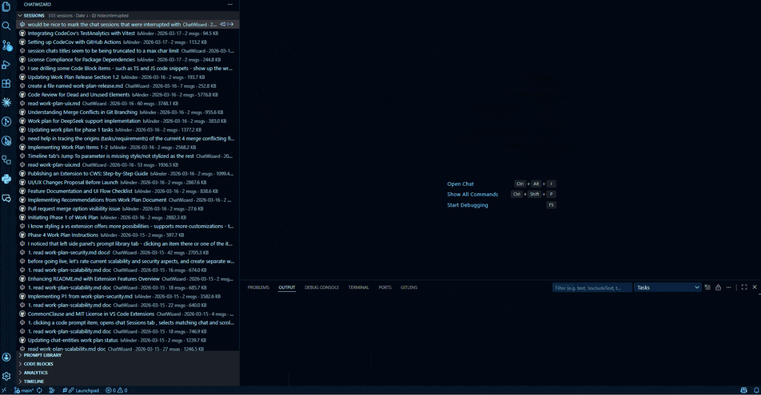
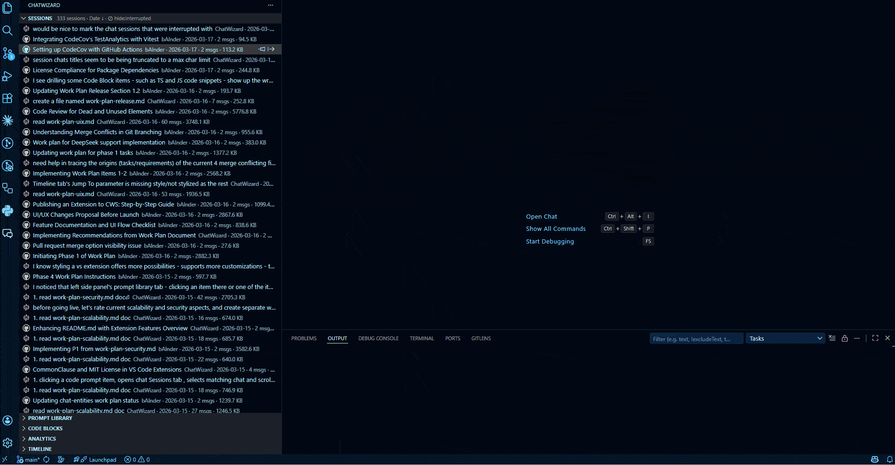
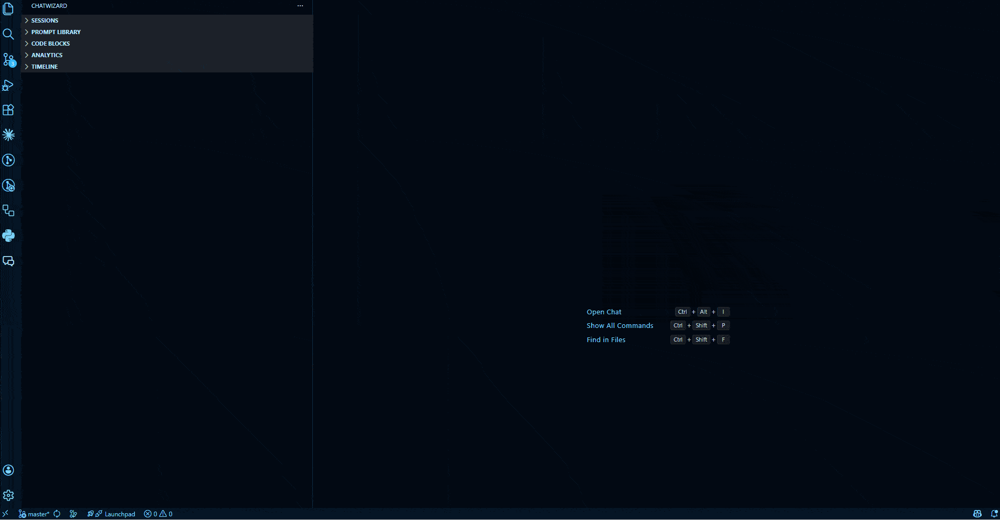
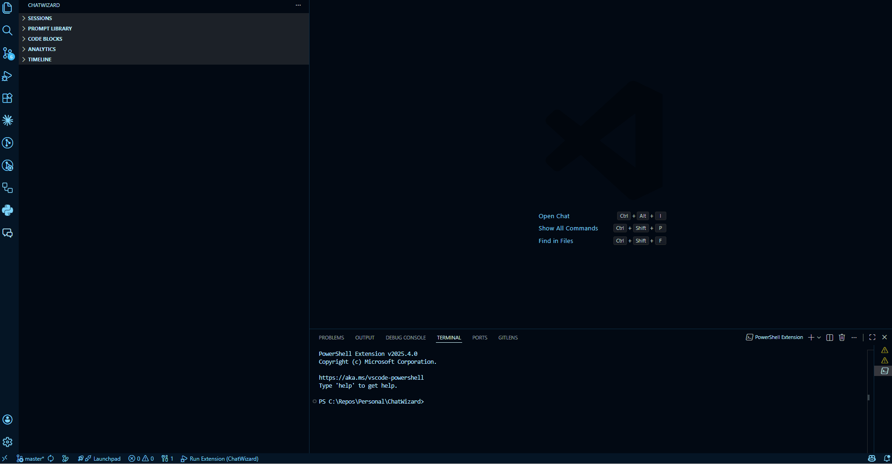
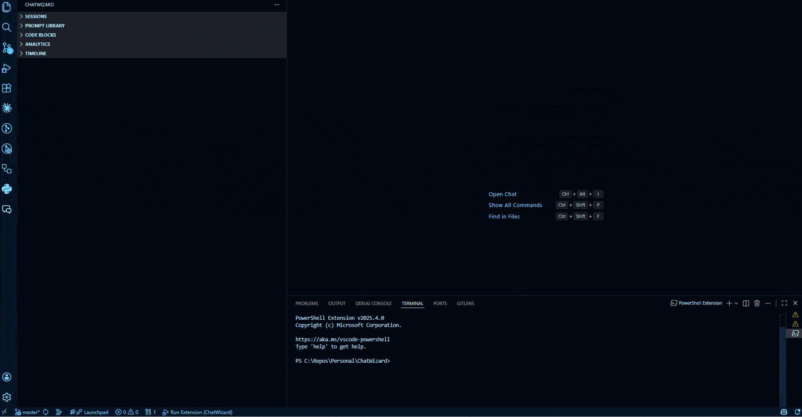
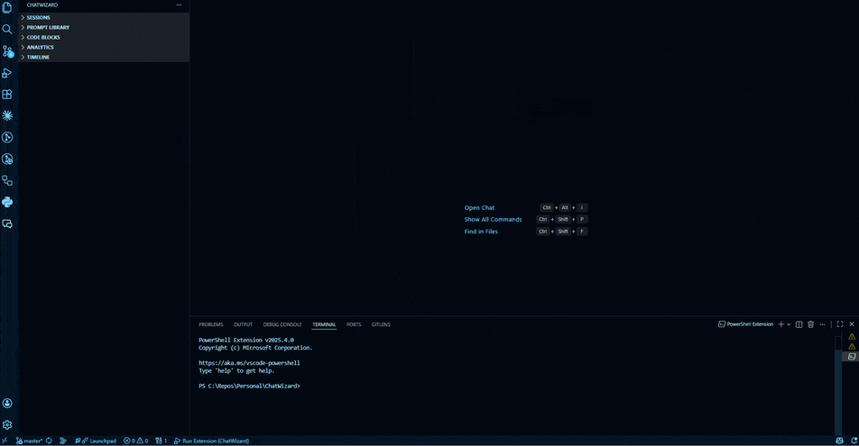
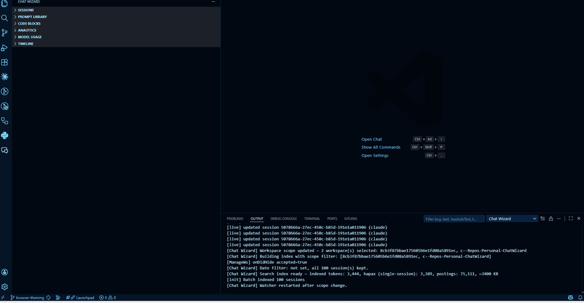

# Chat Wizard

**Chat Wizard is a VS Code extension** that lets you search, analyze, and manage AI chat history from tools like **GitHub Copilot**, **Claude**, **Cursor**, **Cline**, **Windsurf**, **Continue.dev**, **Amazon Q Developer**, **Gemini Code Assist**, and more.

It acts as a **unified AI coding assistant memory and analytics layer** for developers — your conversation history is no longer trapped inside whichever tool or IDE created it. _Inspired by [bAInder](https://github.com/Veverke/bAInder)._

> **Tags:** AI chat manager · Copilot chat manager · Claude chat manager · chat history viewer · prompt library · code block search · token usage analytics · LLM productivity · VS Code AI tools · conversation history manager · Cline chat manager · Roo code chat manager · Cursor chat manager · Windsurf chat manager · Aider chat manager · Google Antigravity chat manager · Continue.dev chat manager · Amazon Q chat manager · Gemini Code Assist chat manager

---

## Why Chat Wizard?

- **Your history travels with you.** Switch from Cursor to VS Code, try Windsurf for a project, add Cline to your workflow — your full conversation archive stays intact and searchable in one place. No more context lost when you change tools or IDEs.
- **Everything in one view.** Whether you use one AI coding tool or five, Chat Wizard aggregates sessions from all of them. Search across a year of Copilot, Claude, Cline, Cursor, Windsurf, Aider, Google Antigravity, Continue.dev, Amazon Q Developer, and Gemini Code Assist conversations in a single query.
- **100% local, read-only, zero setup.** Chat Wizard never makes a network call, never modifies your session files, and requires no API key or account. It passively reads what your existing tools already write to disk.
- **Not just a viewer.** Full-text search with regex, a deduplicated prompt library, a code block archive, per-model usage analytics, and a timeline with activity heat maps — capabilities that no individual AI tool exposes.

---

## AI Chat History Viewer for VS Code

Search and browse all your AI coding conversations in one place. Chat Wizard aggregates session data from every major AI coding tool into a single searchable panel — directly inside VS Code. No context is lost when you switch tools, workspaces, or IDEs.

---

## GitHub Copilot Chat Manager

Chat Wizard lets you explore, search, and analyze your **GitHub Copilot Chat** conversations outside the native Copilot panel. Browse sessions across all your workspaces, search by keyword or regex, export to Markdown, and inject past sessions as context into new chats.

---

## Works With Cursor, Windsurf, Claude Code, Cline & More

Not locked to any single AI coding tool. Chat Wizard reads sessions from **GitHub Copilot**, **Claude Code**, **Cline**, **Roo Code**, **Cursor**, **Windsurf**, **Aider**, **Google Antigravity**, **Continue.dev**, **Amazon Q Developer**, and **Gemini Code Assist** — giving you a unified manager for your entire AI coding history.

---

## Reuse Past AI Answers Without Chatting Again

Instead of asking the same question twice, search your Chat Wizard history. Find the exact code snippet, explanation, or solution from weeks ago in seconds. The **Code Block Library** and **Prompt Library** make your past AI conversations instantly reusable.

---

## Demos

### Search — Search Bar & Search Command

### Export to Markdown — Full Session & Excerpt

### Session Filters

### Prompt Library

### Code Blocks (snippets)

### Analytics

### Model Usage

---

## Features

- **Sessions Panel** — browse, sort, filter, pin, group, and reorder every AI session across all tools and workspaces
- **Full-Text Search** — instant in-memory keyword search with regex support and source/role filters
- **Semantic Search** — topic-similarity search via a local AI model (opt-in, ~22 MB)
- **Code Block Library** — every AI-generated code snippet, filterable by language, with one-click copy
- **Prompt Library** — deduplicated, frequency-ranked archive of all your prompts with near-duplicate clustering and merge
- **Analytics** — token usage charts, daily activity, top projects, top terms, longest sessions
- **Model Usage** — per-model request counts with date-range filtering and workspace/session drill-down
- **Timeline** — chronological feed with activity heat map, work bursts, topic drift ribbon, and streak stats
- **Export** — single session, multi-select, all sessions, or excerpt — to structured Markdown, **Obsidian vault**, or **Notion database**
- **Session Archive** — every indexed session is mirrored locally so history survives source tool pruning
- **Session Tagging** — attach freeform labels to sessions; filter, search, and tag the active session from the status bar or `/tag` chat command
- **File History** — Chronicle-powered "N sessions touched this file" in the status bar, CodeLens, and Explorer right-click; `chatwizard_sessions_for_file` MCP tool
- **Branch & Work Item Grouping** — group sessions by git branch or extracted work-item ID (Jira, GitHub Issues, Azure DevOps)
- **AI Session Summaries** _(Beta)_ — auto-generated one-line summaries for every session (Chronicle data first, then VS Code LM API, then offline TF-IDF)
- **Entity Extraction** _(Beta)_ — automatic extraction of file paths, function names, error codes, and decision phrases; filterable chips in the session reader
- **Prompt Cost Analysis** — offline token count, estimated cost, quality tips, and past-session similarity check for any draft prompt
- **MCP Server** — expose your full chat history to Claude Desktop, Cursor, Continue, and Copilot agent mode via the Model Context Protocol (**11 tools**)
- **`@chatwizard` Copilot Chat Participant** — `/queryHistory`, `/continueFromHistory`, `/tag`, `/referMessage`, and `/analyzePrompt` directly in Copilot Chat, no MCP server required
- **Live Indexing** — file watcher keeps all views up-to-date as new sessions are written, with no manual refresh needed
- **100% local** — no network calls, no account, read-only access to your existing session files

For detailed usage instructions, settings, and commands see the **[User Guide](docs/user-guide.md)**.

---

## Chat Wizard vs. Native Chat Interfaces

Capabilities not available in the built-in GitHub Copilot Chat panel or the Claude Code terminal:

| Capability | Chat Wizard | Copilot Chat (VS Code) | Claude Code (terminal) |
|-----------|:----------:|:---------------------:|:---------------------:|
| Browse all past sessions across all workspaces | ✅ | ❌ per-workspace only | ❌ no GUI history |
| Cross-session full-text search | ✅ | ❌ | ❌ |
| Regex search over chat history | ✅ | ❌ | ❌ |
| Filter sessions by model, date range, message count | ✅ | ❌ | ❌ |
| Multi-key composite sort of session list | ✅ | ❌ | ❌ |
| Pin & drag-and-drop reorder sessions | ✅ | ❌ | ❌ |
| Tag and label sessions | ✅ | ❌ | ❌ |
| Archive sessions to survive source-tool pruning | ✅ | ❌ | ❌ |
| Group sessions by git branch or work-item ID | ✅ | ❌ | ❌ |
| AI-generated one-line session summaries _(Beta)_ | ✅ | ❌ | ❌ |
| Auto-extract entities (files, functions, errors, decisions) _(Beta)_ | ✅ | ❌ | ❌ |
| "N sessions touched this file" in status bar & CodeLens | ✅ | ❌ | ❌ |
| Analyze draft prompt for cost, quality & past-query similarity | ✅ | ❌ | ❌ |
| Export conversations to Markdown | ✅ | ❌ | ❌ |
| Export a message excerpt (selected turns only) | ✅ | ❌ | ❌ |
| Export to Obsidian vault (YAML frontmatter + wikilinks) | ✅ | ❌ | ❌ |
| Export to Notion database (via Notion API) | ✅ | ❌ | ❌ |
| Inject a past session as context into a new chat | ✅ | ❌ | ❌ |
| Unified code block library across all sessions | ✅ | ❌ | ❌ |
| Filter & sort AI-generated code blocks by language, content, source, role | ✅ | ❌ | ❌ |
| One-click copy of any historical code block | ✅ | ❌ | ❌ |
| Deduplicated, searchable prompt library | ✅ | ❌ | ❌ |
| Near-duplicate prompt detection & merge | ✅ | ❌ | ❌ |
| Token-usage analytics & daily activity charts | ✅ | ❌ | ❌ |
| Chronological timeline with jump-to-date | ✅ | ❌ | ❌ |
| Timeline heat map, work bursts & topic drift | ✅ | ❌ | ❌ |
| Per-model request usage dashboard | ✅ | ❌ | ❌ |
| Selective workspace indexing & scope management | ✅ | ❌ | ❌ |
| Live auto-refresh when sessions change | ✅ | ✅ current session | ✅ current session |
| 100% local — no external network calls | ✅ | ✅ | ✅ |
| Expose history to AI tools via MCP (Model Context Protocol) | ✅ | ❌ | ❌ |

---

## Supported AI Chat Extensions

| Extension | Data Source |
|-----------|-------------|
| **GitHub Copilot Chat** | Per-workspace JSONL operation logs at `%APPDATA%/Code/User/workspaceStorage/<hash>/chatSessions/` plus workspace metadata from `state.vscdb` (SQLite) |
| **Claude Code** | Conversation JSONL files at `~/.claude/projects/**/*.jsonl` |
| **Cline** (`saoudrizwan.claude-dev`) | Per-task JSON files at `%APPDATA%/Code/User/globalStorage/saoudrizwan.claude-dev/tasks/<taskId>/` |
| **Roo Code** (`rooveterinaryinc.roo-cline`) | Per-task JSON files at `%APPDATA%/Code/User/globalStorage/rooveterinaryinc.roo-cline/tasks/<taskId>/` (Cline-compatible format) |
| **Cursor** | SQLite `state.vscdb` at `%APPDATA%/Cursor/User/workspaceStorage/<hash>/` — chat history stored under the `composer.composerData` key. Requires `better-sqlite3` (pre-built native module bundled with the extension). |
| **Windsurf** (Codeium) | SQLite `state.vscdb` at `%APPDATA%/Windsurf/User/workspaceStorage/<hash>/` — Cascade chat history stored under the `cascade.sessionData` key. Reuses the same `better-sqlite3` driver. |
| **Aider** | Markdown `.aider.chat.history.md` files written by Aider into each project root. Chat Wizard scans all open VS Code workspace folders plus any paths listed in `chatwizard.aiderSearchRoots` (up to `chatwizard.aiderSearchDepth` levels deep, default 3). Optional `.aider.conf.yml` in the same directory is read for the `model:` key. No central storage directory — files live inside your project repos. |
| **Continue.dev** | JSONL session files at `~/.continue/sessions/` (all platforms). Configurable via `chatwizard.continueStoragePath`. |
| **Amazon Q Developer** | Platform-aware path discovery (`~/.aws/amazonq/` and per-platform variants). Configurable via `chatwizard.amazonQStoragePath`. |
| **Gemini Code Assist** | VS Code extension `globalStorageUri` for the Gemini Code Assist extension. Path discrimination prevents overlap with the existing Antigravity source. Configurable via `chatwizard.geminiCodeAssistStoragePath`. |

> For tools with partial support, see [Limited Support](#limited-support) below.

---

## Limited Support

Some tools are supported with constraints. Features that operate on prompts alone — **Prompt Library**, **Full-Text Search**, **Analytics**, and **Timeline** — work fully. The session reader displays an informational banner explaining what is unavailable.

| Tool | What works | Limitation |
|------|-----------|------------|
| **Google Antigravity** | Prompt Library, full-text search, analytics, timeline, session reader (prompts only) | AI responses are not available from disk. Antigravity stores conversation content in an encrypted format that requires the running Language Server to decode. Only prompts are indexed. Configurable via `chatwizard.indexAntigravity` / `chatwizard.antigravityBrainPath`. |

---

## Installation

1. **VS Code Marketplace** — search for "ChatWizard" in the Extensions view and click Install.
2. **Manual install** — download the `.vsix` file and run `Extensions: Install from VSIX…` from the Command Palette.
3. The extension activates automatically on VS Code startup (`onStartupFinished`). No configuration is required for standard GitHub Copilot Chat and Claude Code installs.

---

## Requirements

- VS Code **1.85.0** or later.
- At least one supported AI coding tool installed and actively used: **GitHub Copilot Chat**, **Claude Code**, **Cline**, **Roo Code**, **Cursor**, **Windsurf**, **Aider**, **Continue.dev**, **Amazon Q Developer**, **Gemini Code Assist**, or **Google Antigravity** (limited support — prompts only; see [Limited Support](#limited-support)). Chat Wizard reads the session files these tools write — it does not create sessions itself and requires no additional configuration for standard installs.

---

## Extension Settings

See the **[User Guide → Settings Reference](docs/user-guide.md#14-settings-reference)**.

---

## Commands

See the **[User Guide → Commands Reference](docs/user-guide.md#15-commands-reference)**.

---

## Architecture & Privacy

- **All processing is local.** Chat Wizard never makes network requests. No session content, metadata, or telemetry is ever transmitted to any external server.
- **Read-only access.** Chat Wizard reads AI chat session files but never writes to them or modifies them in any way.
- **Live index updates.** A `FileSystemWatcher` monitors the session directories and rebuilds the affected index entries whenever new sessions are created or existing ones are updated. All views refresh automatically.
- **No external indexing dependencies.** Full-text search uses a custom in-memory inverted index. Similarity clustering uses trigram scoring. Analytics use local token-count approximations. No ML models, no network calls.
- **MCP server — local and auth-gated.** When enabled, the MCP server binds exclusively to `127.0.0.1` (never `0.0.0.0`). All requests require a bearer token generated with `crypto.randomBytes(32)` and stored in VS Code's extension storage. The token is never logged. A `/health` endpoint is intentionally unauthenticated so clients can verify connectivity; it returns only `{ status: "ok", sessions: N }`.
- **Local telemetry (opt-in).** If `chatwizard.enableTelemetry` is enabled, usage events are appended to a JSONL file inside the extension's VS Code global storage directory on your local machine. This file is never read by any external service.

---

## Known Limitations

- **Copilot Chat session parsing** reconstructs conversation state by replaying an append-only operation log. Very large sessions (hundreds of messages) may take slightly longer to parse on first index build.
- **Claude Code epoch sessions** — sessions with a creation date of 1970-01-01 (epoch) or with zero messages are silently skipped during indexing. This matches Claude Code's own behavior of writing placeholder files before sessions are populated.
- **Token counts are approximations.** Chat Wizard uses character-based counting (characters / 4) for Claude and Google Antigravity (Gemini) sessions, and word-based counting (words x 1.3) for Copilot/GPT sessions. These figures are estimates and will not exactly match the billing token counts reported by the respective providers.
- **Cursor and Windsurf schema stability.** Both IDEs store chat data in private SQLite databases whose internal schema can change in any update without notice. Chat Wizard targets the current schema; a future Cursor or Windsurf release may require a matching Chat Wizard update before sessions from those sources are visible again.
---

## Release Notes

### 1.5.0

- **Three new sources** — **Continue.dev**, **Amazon Q Developer**, and **Gemini Code Assist**. All three participate in search, analytics, archive, and MCP.
- **Chronicle Phase 3 — File-Centric History** — `$(comment) N sessions` status bar item and CodeLens for the active file; Explorer right-click "Show File History"; `chatwizard_sessions_for_file` MCP tool.
- **Chronicle Phase 4 — Branch & Work Item Grouping** — By Branch and By Work Item group modes on the Sessions panel; `chatwizard.workItemPattern` setting; `chatwizard_sessions_for_branch` and `chatwizard_sessions_for_work_item` MCP tools.
- **Session Archive** — all sessions mirrored locally; `· archived` badge when source is gone; `Show Archive Statistics` command; configurable age/size pruning.
- **Session Tagging** — right-click Add/Remove Tag; tag chips in tree and reader; tag filter; `Tag Active Session` command and status bar button; `@chatwizard /tag` and `/removeTags` chat commands.
- **AI Session Summaries** _(Beta)_ — background generation via Chronicle → LM API → TF-IDF fallback; shown in tree tooltip and reader header; `Regenerate Summary` context menu.
- **Entity Extraction** _(Beta)_ — auto-extracted file paths, function names, errors, and decisions; entity chips in session reader; `chatwizard_search` entity filter parameters.
- **Prompt Cost Analysis** — `@chatwizard /analyzePrompt`; `ChatWizard: Analyze Selected Prompt` editor command; offline token count, cost estimate, quality flags, and similarity check.
- **Obsidian & Notion export** — `ChatWizard: Export Sessions to Obsidian` (YAML frontmatter + wikilinks); `ChatWizard: Export Sessions to Notion` (Notion API; key in SecretStorage).
- **`@chatwizard` new commands** — `/referMessage` (quote a turn by P/R label); clickable file pills in `/continueFromHistory`.
- **MCP Server** — 3 new tools (total: **11**); optional TF-IDF reranker for `chatwizard_get_context` (`chatwizard.mcp.reranker.enabled`).
- **Session Reader** — `P{N}` / `R{N}` turn labels with ⧉ copy-as-reference button on every message.
- **Squirrel mascot** 🐿️ — persistent status bar icon with gentle pulse animation.
- VS Code 1.121 API compatibility.

### 1.4.0

- **MCP Server Mode** — local HTTP/SSE server exposing your full chat history via the Model Context Protocol. Binds to `localhost` only; all requests require a bearer token. Enable via `chatwizard.mcpServer.enabled`.
  - **8 MCP tools:** `chatwizard_search`, `chatwizard_find_similar`, `chatwizard_get_session`, `chatwizard_get_session_full`, `chatwizard_list_recent`, `chatwizard_get_context`, `chatwizard_list_sources`, `chatwizard_server_info`.
  - **2 MCP prompts:** `chatwizard.queryHistory`, `chatwizard.continueFromHistory` — available to any MCP client.
  - Config clipboard flow, status bar indicator, first-run consent modal.
  - **Token rotation** — `Chat Wizard: Rotate MCP Token` (`chatwizard.rotateMcpToken`) generates a new bearer token. Gated by `chatwizard.mcpServer.allowTokenRotation`.
  - **`Chat Wizard: Connect GitHub Copilot`** and **`Chat Wizard: Set Up Global Copilot Instructions`** commands for quick one-click setup.
- **`@chatwizard` Copilot Chat Participant** — use `/queryHistory` and `/continueFromHistory` directly in Copilot Chat without the MCP server running. `/queryHistory` shows the top-3 matching sessions and, on confirmation, consolidates all three and derives a semantically grounded answer.
- **VS Code Insiders support** — Copilot workspace storage is now auto-discovered from both stable (`Code`) and Insiders (`Code - Insiders`) installs.
- **Improved full-text search** — stop-word filtering and basic de-pluralisation raise relevance of keyword results.
- **Extension update notifier** — silent daily Marketplace check; shows a notification with an Open in Marketplace link when a newer version is available.

### 1.3.0

- **Google Antigravity support (limited)** — indexes user prompts from Google Antigravity stored at `~/.gemini/antigravity/brain/<uuid>/.system_generated/logs/overview.txt` (JSONL step logs). AI responses are not available from disk (stored in an encrypted format). Configurable via `chatwizard.indexAntigravity` / `chatwizard.antigravityBrainPath`.
- Antigravity prompts participate in search, prompt library, analytics, model usage, timeline, and source filtering. The session reader shows prompts only with an informational banner.
- Token counting for Antigravity sessions uses the Gemini character ÷ 4 approximation.
- Antigravity brand icon, CSS theme variable, and badge class added.

### 1.2.0

- **Cline support** — indexes Cline (`saoudrizwan.claude-dev`) task history; model and workspace path read from `ui_messages.json`; configurable via `chatwizard.indexCline` / `chatwizard.clineStoragePath`.
- **Roo Code support** — indexes Roo Code (`rooveterinaryinc.roo-cline`) task history (Cline-compatible format); configurable via `chatwizard.indexRooCode` / `chatwizard.rooCodeStoragePath`.
- **Cursor support** — indexes Cursor chat and agent sessions from SQLite `state.vscdb` (`composer.composerData`); configurable via `chatwizard.indexCursor` / `chatwizard.cursorStoragePath`.
- **Windsurf support** — indexes Windsurf Cascade sessions from SQLite `state.vscdb` (`cascade.sessionData`); configurable via `chatwizard.indexWindsurf` / `chatwizard.windsurfStoragePath`.
- **Aider support** — discovers `.aider.chat.history.md` files in workspace folders and `chatwizard.aiderSearchRoots`; model from `.aider.conf.yml`; configurable via `chatwizard.indexAider`, `chatwizard.aiderSearchRoots`, `chatwizard.aiderSearchDepth`.
- All new sources participate in search, prompt library, code blocks, analytics, model usage, and timeline.
- Cursor-native model IDs normalised (`cursor-fast`, `cursor-small`).

### 1.1.0

- **Workspace Management** — new `Manage Watched Workspaces` command lets you select exactly which Copilot and Claude workspaces to index; shows size and session count per workspace; persists selection and restarts the watcher.
- **Model Usage panel** — new sidebar tab showing per-model user request counts over a configurable date range, with workspace and session drill-down and friendly model name normalisation.
- **Timeline enhancements** — added activity heat map (click a day to filter), work burst clustering (2-hour window), per-week topic drift ribbon, summary stats bar (streak, active days, on-this-day), and inline keyword search.

### 1.0.4

Initial release. All nine development phases complete:

- Phase 0: Foundation — parsers, file watchers, session index
- Phase 1: Session Management Panel — TreeView, reader, sort, filter, pin, drag-drop
- Phase 2: Unified Full-Text Search — inverted index, QuickPick UI, regex, role filters
- Phase 3: Export to Markdown — single, all, multi-select, excerpt, inject as context
- Phase 4: Code Block Extraction — language filter, content search, copy-to-clipboard
- Phase 5: Prompt Library — deduplication, frequency ranking, copy
- Phase 6: Analytics Dashboard — token usage, daily activity chart, top projects, top terms
- Phase 7: Duplicate Prompt Detection — trigram similarity clusters, merge action
- Phase 8: Timeline View — chronological feed, month groups, workspace filter, jump-to-date
- Phase 9: Polish — configurable data source paths, local telemetry opt-in, release packaging

---

## Support the Project

If Chat Wizard is saving you time, a quick ⭐ review takes 30 seconds and makes a real difference for discoverability:

→ [**Leave a review on VS Code Marketplace**](https://marketplace.visualstudio.com/items?itemName=Veverke.chatwizard&ssr=false#review-details)  
→ [**Leave a review on Open VSX Registry**](https://open-vsx.org/extension/Veverke/chatwizard)

---

## Contributing

Issues and pull requests are welcome at [https://github.com/veverke/chatwizard](https://github.com/veverke/chatwizard).

Found a bug or have a feature request? [Open an issue on GitHub](https://github.com/veverke/chatwizard/issues) — every report is read and responded to.

---

## License

This project is licensed under the **MIT License with Commons Clause** — see [LICENSE](LICENSE) for the full text.

In plain terms:
- You may use, copy, modify, and distribute the source code freely.
- You may **not** sell the software or offer it as a paid product or service (including hosting or consulting services whose value derives substantially from this software).

This is **source-available** software. It is not OSI-certified open source.
